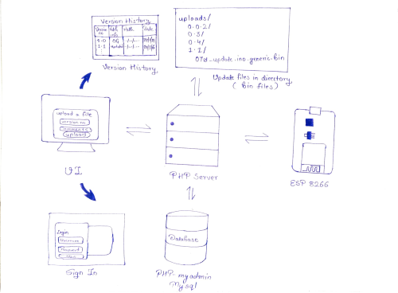
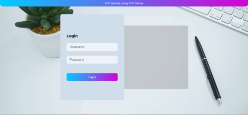
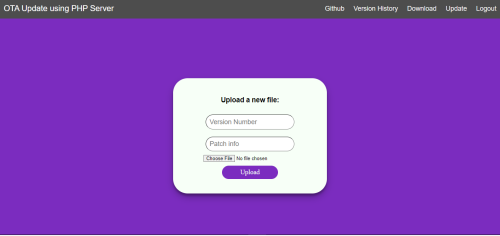
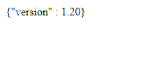
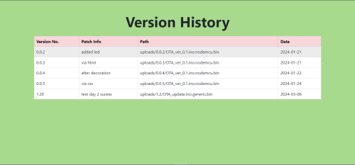
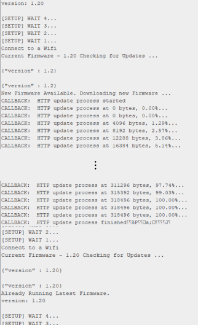

# OTA-Update-using-PHP

This project implements PHP scripting language to create a server for updating the firmware of ESP8266 based devices via `OTA (On The Air)`. It displays a dashboard for inserting the firmware file with its version and patch info. This file is saved in the uploads folder in the respective version number and can be accessed by the ESP8266 by checking the latest version on the `update.php`. This metadata about the new firmware is stored in the `MySQL` database. The dashboard also has a provision to view the `Version History`. The entire services are accesible to the user once logged in.

## Block Diagram

  
  
Block Diagram

## Snaps of UI

  
  
Login UI

  
  
Dashboard

  
  
JSON on Updates.php

  
  
Version History

  
  
Serial data on COM port

